# python_labs

## Лабораторная работа 1

### Задание номер 1

```python
name = input('ИМЯ:')
age = int(input('ВОЗРАСТ:'))
print(f'Привет, {name}! Через год тебе будет {age + 1}.')
```
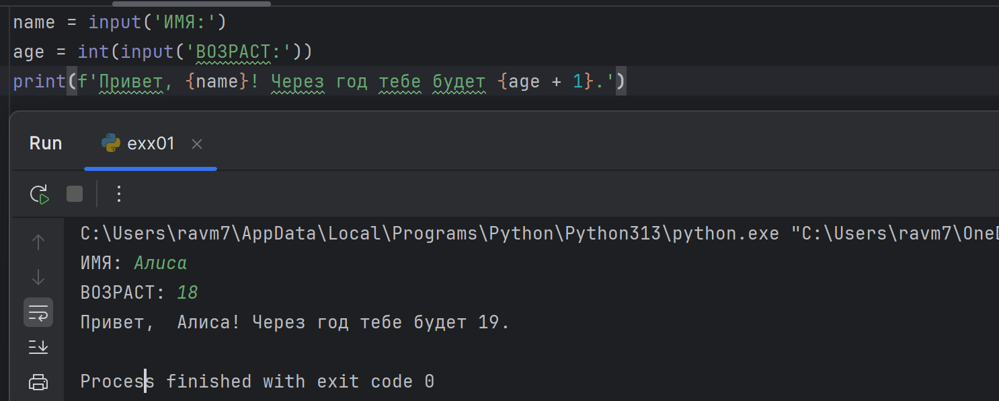

### Задание номер 2

```python
a = float(input('Введите число').replace(',', '.'))
b = float(input('Введите число').replace(',', '.'))
s = a + b
av =round(s / 2, ndigits = 2)
print(f'sum = {s}; avg = {av}')
```
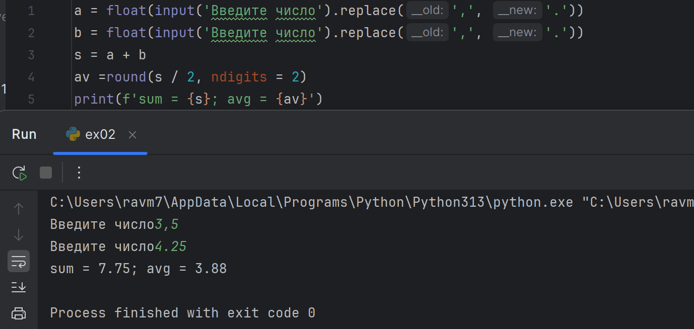

### Задание номер 3
```python
price = float(input('Цена, ₽:'))
discount = float(input('Скидка, %:'))
vat = float(input('НДС, %:'))

base = price * ( 1 - discount / 100)
vat_amount = base * (vat / 100)
total = base + vat_amount
print(f'База после скидки: {base:.2f} ₽')
print(f'НДС: {vat_amount:.2f} ₽')
print(f'Итого к оплате: {total:.2f} ₽')
```
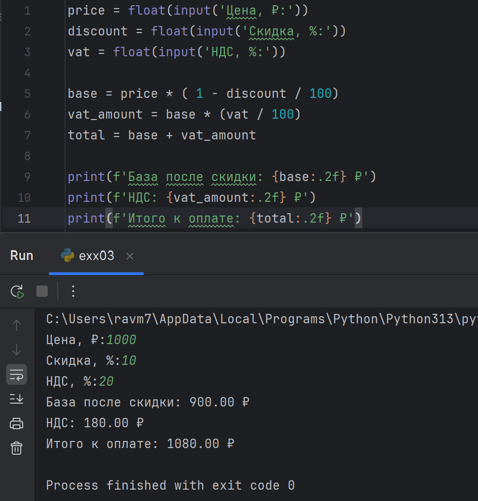

### Задание номер 4
```python
m = int(input('Целые минуты'))
hours = m//60
minutes = m % 60
print(f'{hours}:{minutes:02d}')
```
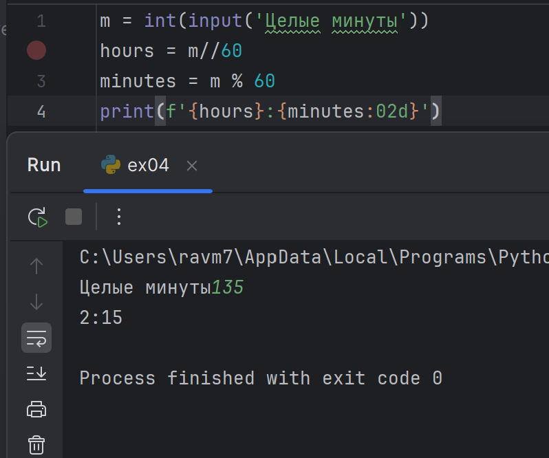

### Задание номер 5
```python
fio = input('Введите ФИО')
fio = fio.split()
initials = [fio[i][0] for i in range(len(fio))]
initials = ''.join(initials)

fio = ' '.join(fio)
symbols = len(fio)

print(f'Инициалы: {initials}.')
print(f'Длина Символов: {symbols}')
```
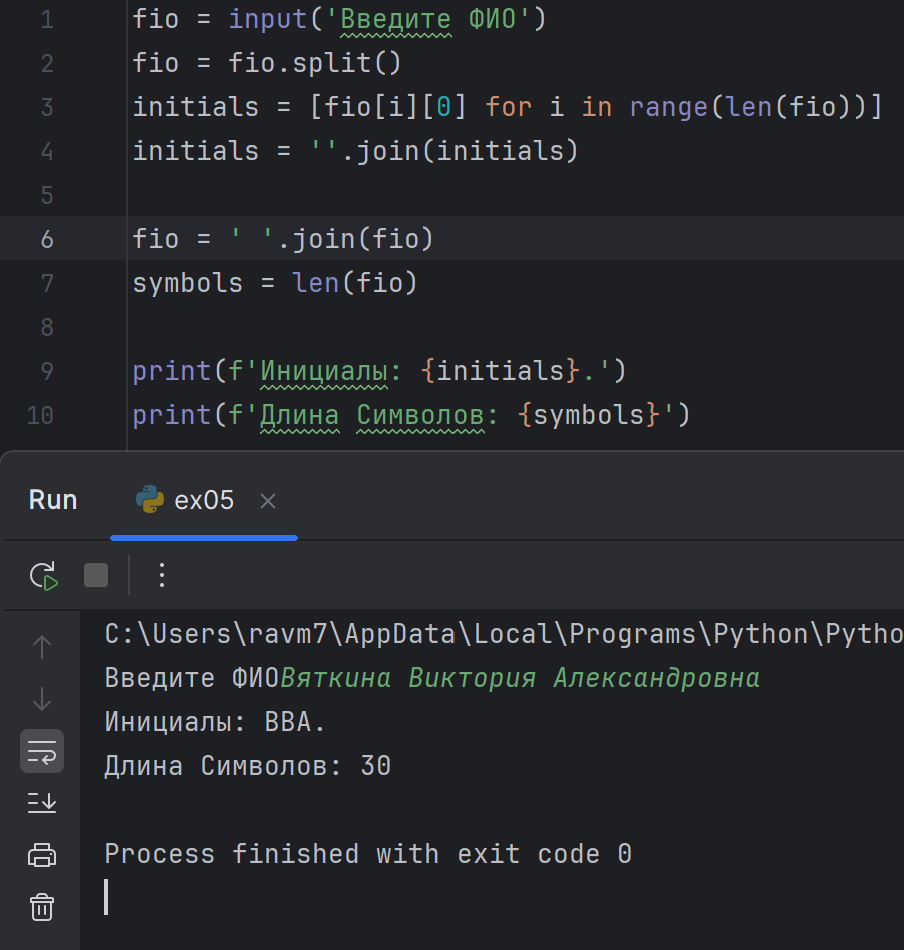


## Лабораторная работа 2
### Задание А

```python
def min_max(nums: list[float | int]) -> tuple[float | int, float | int]:
    if len(nums) == 0:
        return 'ValueError'
    return(min(nums), max(nums))
print(min_max([3, -1, 5, 5, 0]))
print(min_max([42]))
print(min_max([-5, -2, -9]))
print(min_max([]))
print(min_max([1.5, 2, 2.0, -3.1]))

def unique_sorted(nums: list[float | int]) -> list[float | int]:
    result = []
    m = -10 * 10
    nums = sorted(nums)
    for i in nums:
        if i > m:
            result.append(i)
            m = i
    return result
print(unique_sorted([3, 1, 2, 1, 3]))
print(unique_sorted([]))
print(unique_sorted([-1, -1, 0, 2, 2]))
print(unique_sorted([1.0, 1, 2.5, 2.5, 0]))

def flatten(mat: list[list | tuple]) -> list:
    for a in mat:
        if not(isinstance(a, (list, tuple))):
            return 'TypeError'
    result = []
    for i in range(len(mat)):
        for j in range(len(mat[i])):
            result.append(mat[i][j])
    return result 
print(flatten([[1, 2], [3, 4]]))
print(flatten([[1, 2], (3, 4, 5)]))
print(flatten([[1], [], [2, 3]]))
print(flatten([[1, 2], "ab"]))
```
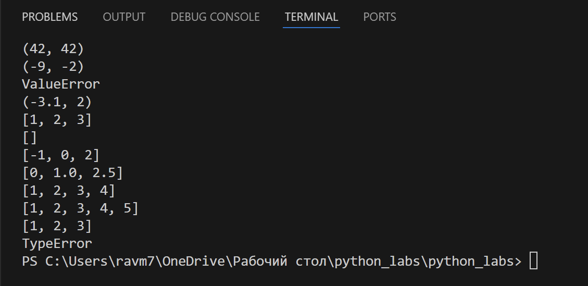

### Задание B

```python
def transpose(mat: list[list[float | int]]) -> list[list]:
    if len(mat) == 0:
        return []
    for a in range(len(mat)):
        if len(mat[a]) != len(mat[0]):
            return 'ValueError'
    stroci = len(mat)
    colons = len(mat[0])
    result = []
    for i in range(colons):
        colons1 = [0]*stroci
        result.append(colons1)
    for s in range(stroci):
        for e in range(colons):
            result[e][s] = mat[s][e]
        return result
print(transpose([[1, 2, 3]]))
print(transpose([[1], [2], [3]]))
print(transpose([[1, 2], [3, 4]]))
print(transpose([]))
print(transpose([[1, 2], [3]]))

def row_sums(mat: list[list[float | int]]) -> list[float]:
    if len(mat) == 0:
        return []
    for a in range(len(mat)):
        if len(mat[a]) != len(mat[0]):
            return 'ValueError'
    sums = []
    for i in range(len(mat)):
        sums.append(sum(mat[i]))
    return sums
print(row_sums([[1, 2, 3], [4, 5, 6]]))
print(row_sums([[-1, 1], [10, -10]]))
print(row_sums([[0, 0], [0, 0]]))
print(row_sums([[1, 2], [3]]))

def col_sums(mat: list[list[float | int]]) -> list[float]:
    if len(mat)==0:
        return []
    for a in range(len(mat)):
        if len(mat[a]) != len(mat[0]):
            return 'ValueError'
    sums = []
    for j in range(len(mat[0])):
        s = 0
        for i in range(len(mat)):
            s = s + mat[i][j]
        sums.append(s)
    return sums
print(col_sums([[1, 2, 3], [4, 5, 6]]))
print(col_sums([[-1, 1], [10, -10]]))
print(col_sums([[0, 0], [0, 0]]))
print(col_sums([[1, 2], [3]]))
```
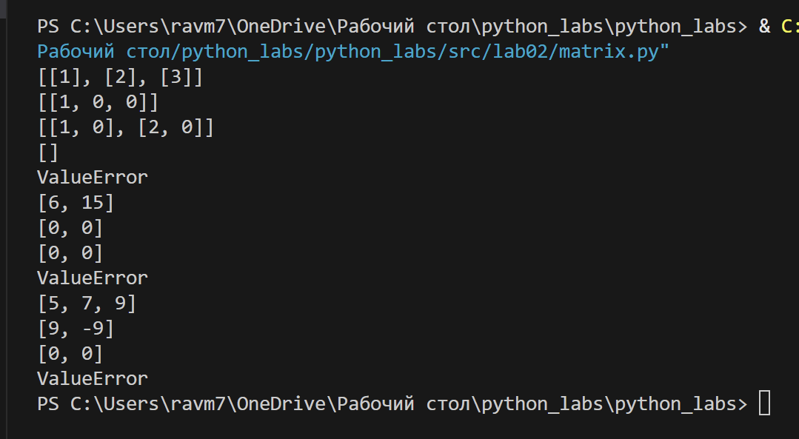

### Задание C

```python
def format_record(rec: tuple[str, str, float]) -> str:
    if any(str(x)=='' for x in rec):
        return 'ValueError'

    fio=str(rec[0]).split()
    group=str(rec[1])
    gpa=f'{float(rec[2]):.2f}'
    fio1=''
    fam=0 

    for i in range(len(fio)):
        if fio[i]!='' and fam==0:
            first_let=str(fio[i])[0].upper() 
            fio1+=first_let+str(fio[i][1:])+' '
            fam=1
        elif fio[i]!='' and fam==1:
            first_let=str(fio[i])[0].upper()
            fio1 += first_let + '.'
    res=fio1+', гр. '+group+', GPA '+str(gpa)
    return res
r=("Иванов Иван Иванович", "BIVT-25", 4.6)
r2=("Петров Пётр", "IKBO-12", 5.0)
r3=("Петров Пётр Петрович", "IKBO-12", 5.0)
r4=("  сидорова  анна   сергеевна ", "ABB-01", 3.999)
print(format_record(r))
print(format_record(r2))
print(format_record(r3))
print(format_record(r4))
```
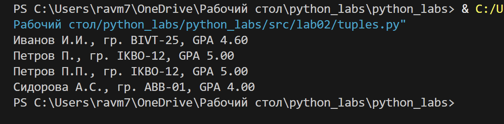


## Лабораторная работа 3
### Задание А 
### №1
```python
def normalize(text: str, *, casefold: bool = True, yo2e: bool = True) -> str:
    if casefold == True:
        text = text.casefold()
        #приводим к нижнему регистру
    if yo2e == True:
        text = text.replace('ё', 'е').replace('Ё', 'Е')
        #заменяем ё и Ё
    simbols = {'\t', '\r', '\n'}
    for i in simbols:
        text = text.replace(i, ' ')
    while '  ' in text: #вырезаем повторяющиеся пробелы
        text = text.replace('  ', ' ')
    text = text.strip()

    return text
```
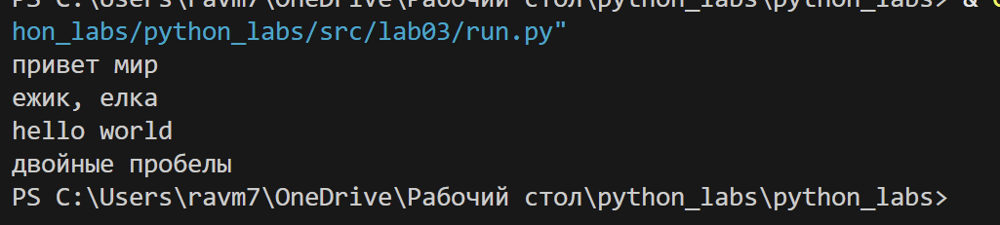

### №2
```python
def tokenize(text: str) -> list[str]:
    text_def = []
    i = 0
    while i < len(text):
        if text[i] == '-':
            if i > 0 and i < len(text) - 1: #если он не с краю
                if (text[i-1].isalnum() or text[i-1] == '_') and (text[i+1].isalnum() or text[i+1] == '_'):
                    text_def.append('_') #замена с дефиса на _
        else:
            text_def.append(text[i])
        i += 1
    text_def = ''.join(text_def) + ' '
    slovo = ''
    res = []
    for x in text_def:
        if x.isalnum() or x == '_':
            slovo += x
        else:
            if len(slovo) != 0:
                slovo = slovo.replace('_', '-') #обратно возвращаем дефисы
                res.append(slovo) #добавляем слово
                slovo = '' #освобождаем ячейку для следующего слова
    return res
```
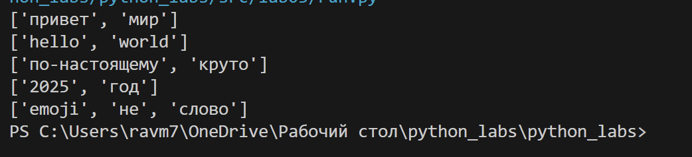

### №3-№4
```python
def count_freq(tokens: list[str]) -> dict[str, int]:
    res = {}
    for i in tokens:
        res[i] = res.get(i,0) + 1
    sorted_res = sorted(res.items(), key = lambda i: (i[0], i[1]))
    return dict(sorted_res)


def top_n(freq: dict[str, int], n: int = 5) -> list[tuple[str, int]]:
    c = list(count_freq(freq).items())
    return c[:n]
```

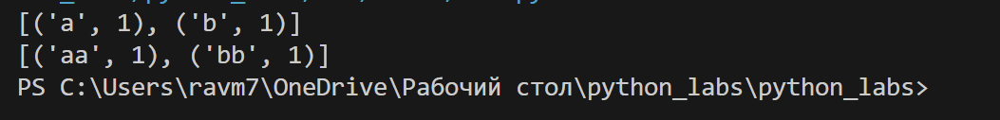

### Заадание В
```python
import sys
import os
sys.path.insert(0, os.path.abspath(os.path.join(os.path.dirname(__file__), '..', '..')))
from src.lib.text import*

text = sys.stdin.read()

textn = text

text = normalize(text)
text = tokenize(text)
textn = text
top = top_n(count_freq(text), n = 5)
text = top_n(count_freq(text))


print(f"Всего слов: {len(textn)}")
print(f"Уникальных слов: {len(text)}")
print("Топ-5:")
for word, count in top:
    print(f"{word}: {count}")
```
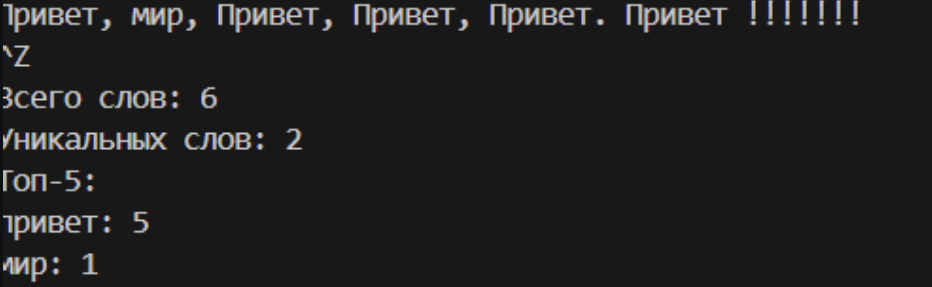


## Лабораторная работа 4
### А
```python
import csv
from pathlib import Path
from typing import Iterable, Sequence

def read_text(path: str | Path, encoding: str = "utf-8") -> str:

    p = Path(path)

    if p.exists() == False:
        raise FileNotFoundError
    
    return p.read_text(encoding=encoding)

def ensure_parent_dir(path: str | Path) -> None:

    p = Path(path)
    p.parent.mkdir(parents=True, exist_ok=True)

def write_csv(rows: list[tuple | list], path: str | Path, header: tuple[str, ...] | None = None) -> None:

    row_list = list(rows)

    if row_list:

        first_length = len(row_list[0])

        for i, row in enumerate(row_list):

            if len(row) != first_length:

                raise ValueError()
    ensure_parent_dir(path)

    p = Path(path)

    with p.open("w", newline="", encoding="utf-8") as f:

        writer = csv.writer(f)

        if header is not None:
            writer.writerow(header)
        writer.writerows(rows)

txt = read_text("data/input.txt")  # должен вернуть строку
write_csv([("word","count"),("test",3)], "data/check.csv")  # создаст CSV

```

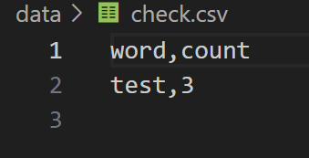

## B
```python
import sys   
sys.path.append('C:/Users/ravm7/OneDrive/Рабочий стол/python_labs/python_labs/src')
from lib.text import normalize, tokenize, count_freq, top_n
from lib.io_txt_csv import read_text, write_csv, write_text


txt = read_text('data/lab04/input.txt')
txt = tokenize(normalize(txt))
txt_counts = top_n(count_freq(txt))
print('Всего слов:', len(txt))
print('Уникальных слов:', len(set(txt)))
print('Топ-5:')
for i in txt_counts:  
    print( f'{i[0]}:{i[1]}') 

write_csv(txt_counts, 'data/lab04/report.csv', ("word","count"))
```
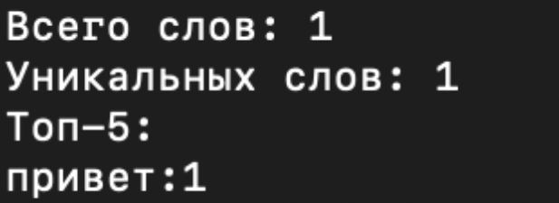


## Лабораторная работа 5
### Задание А
json to csv
```python
from pathlib import Path
import json
import csv
import sys
sys.path.append('C:/Users/ravm7/"Рабочий стол"/python_labs/python_labs')

def json_to_csv(json_path: str, csv_path: str) -> None:
    """
    Преобразует JSON-файл в CSV.
    Поддерживает список словарей [{...}, {...}], заполняет отсутствующие поля пустыми строками.
    Кодировка UTF-8. Порядок колонок — как в первом объекте или алфавитный (указать в README).
    """
    json_path = Path(json_path)   # Создаем путь к файлу - Path-объект
    
    if not json_path.exists():   # Явная проверка существования пути
        raise FileExistsError('Путь не найден')

    with open(json_path, 'r', encoding='utf-8') as json_file:
        try:
            data_json = json.load(json_file)

        except json.JSONDecodeError:   #файл невозможно загрузить в формате JSON
            raise ValueError("Пустой JSON или неподдерживаемая структура")
        
        except not data_json:  # Явная проверка существования файла
            raise FileNotFoundError("Файл не найден")
        
        except not isinstance(data_json, list):
            raise ValueError('Файл не JSON формата: не список словарей')
        
        except not all(isinstance(row, dict) for row in data_json):
            raise ValueError('Файл не JSON формата: в списке не словари')
    '''
    Работаем с CSV-файлом, записывая в него данные из загруженного ранее JSON-файла.
    '''

    csv_path = Path(csv_path)

    with open(csv_path, 'w', encoding='utf-8', newline='') as csv_file:
        writer = csv.DictWriter(csv_file, fieldnames=data_json[0].keys()) # Записывает список словарей, заголовок - ключи словарей
        writer.writeheader()
        writer.writerows(data_json) # Записываем данные построчно
```
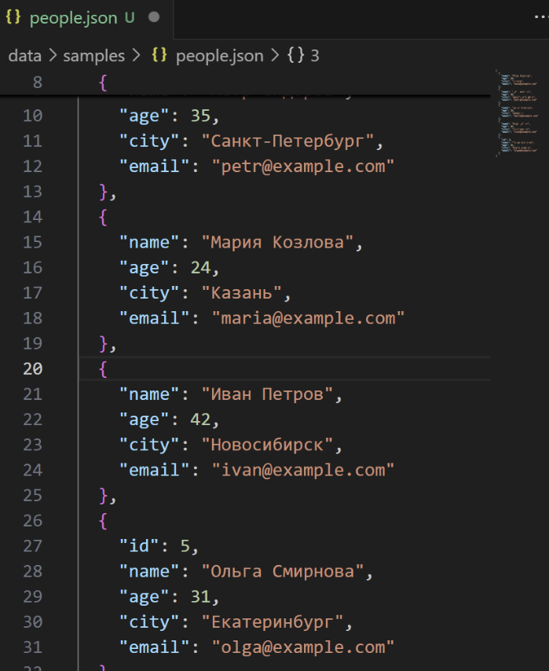
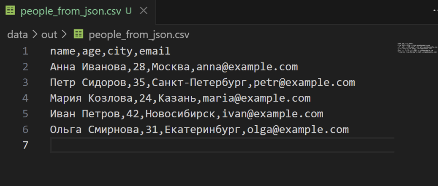

csv to json

```python
from pathlib import Path
import json
import csv
import sys
sys.path.append('C:/Users/ravm7/"Рабочий стол"/python_labs/python_labs')

def csv_to_json(csv_path: str, json_path: str) -> None:
    """
    Преобразует CSV в JSON (список словарей).
    Заголовок обязателен, значения сохраняются как строки.
    json.dump(..., ensure_ascii=False, indent=2)
    """

    csv_path = Path(csv_path)

    if not csv_path.exists():
        raise FileNotFoundError('Файл не найден')
    
    if csv_path.suffix != '.csv':
            raise ValueError("Неверный тип файла")
    '''
    Работаем с открытым CSV-файлом, пробуем читать как список словарей и отлавливаем ошибки.
    '''
    with open(csv_path, 'r', encoding='utf-8') as csv_file:
        try:
            data_csv = csv.DictReader(csv_file)

        except data_csv.fieldnames is None:
            raise ValueError('Отсутствуют заголовки')
        
        if len(list(data_csv)) == 0:
             raise ValueError("Пустой файл")
        data_csv = list(data_csv) # Создаёт список данных, сохраняем считанные данные

    json_path = Path(json_path)
    '''
    Работаем с JSON-файлом, загружая в него данные из CSV_файла.
    '''
    with open(json_path, 'w', encoding='utf-8') as json_file:
        json.dump(json.dump(data_csv, json_file, ensure_ascii=False, indent=2))
        '''
        data_csv - что записываем
        json_file -  куда записываем
        ensure_ascii=False - корректная работа с кириллицей
        indent=2 - красивый вывод
        '''
```
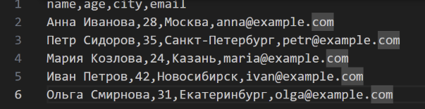
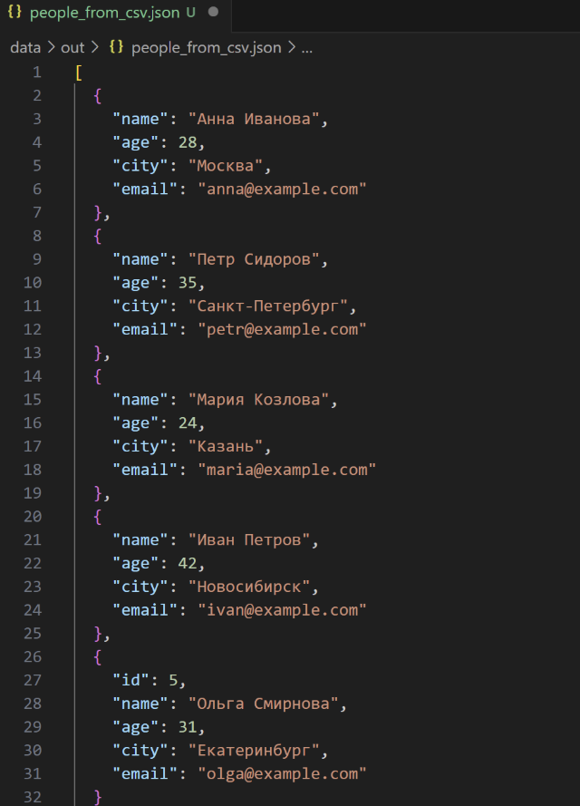

### Задание B
```python
from pathlib import Path
import csv
from openpyxl import Workbook
from openpyxl.utils import get_column_letter # Утилита openpyxl для получения буквы столбца таблицы

def csv_to_xlsx(csv_path: str, xlsx_path: str) -> None:
    """
    Конвертирует CSV в XLSX.
    Использовать openpyxl ИЛИ xlsxwriter.
    Первая строка CSV — заголовок.
    Лист называется "Sheet1".
    Колонки — автоширина по длине текста (не менее 8 символов).
    """

    csv_path = Path(csv_path)
    xlsx_path = Path(xlsx_path)

    if not csv_path.exists():  # Явная проверка существования файла
        raise FileNotFoundError('Файл не найден')
    
    if not xlsx_path.exists():  # Явная проверка существования файла
        raise FileNotFoundError('Файл не найден')
    
    if csv_path.suffix != '.csv':
            raise ValueError("Неверный тип файла")
    '''
    Работаем с CSV-файлом, читаем из него информацию и проверяем на наличие ошибок. Если они есть - они всплывают.
    '''
    with open(csv_path, 'r', encoding='utf-8') as csv_file:
        reader = csv.DictReader(csv_file)
        csv_file = list(reader) # Сохраняем считанные данные в список
        if len(csv_file) == 0:
             raise ValueError("Пустой файл")
        
        if not reader.fieldnames:
             raise ValueError('Файл не содержит заголовков')
        
        wb = Workbook()      # Создаем рабочую книгу
        ws = wb.active       # Создаём в ней новый лист
        ws.title = "Sheet1"  # Называем его

        ws.append(reader.fieldnames)  # Добавляем заголовок
        for row in csv_file:
            ws.append([row[field] for field in reader.fieldnames])  # В каждую строку таблицы добавляем соответствующую ей информацию
        
        for column in ws.columns:   # Равняем всё по ширине, 8 - минимум
            max_length = 8
            column_letter = get_column_letter(column[0].column)
            for cell in column:
                max_length = max(len(str(cell.value)), max_length)

            ws.column_dimensions[column_letter].width = max_length
            

    wb.save(xlsx_path)  # Сохраняем все изменения в указанном пути
```
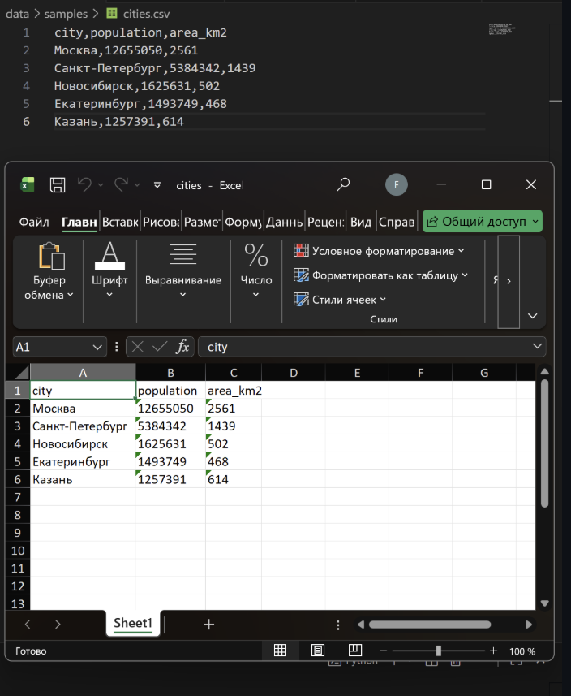


## Лабораторная работа 6
### CLI_text
```python
import argparse
from pathlib import Path
from src.lib.text import tokenize, count_freq, top_n

def main():

    parser = argparse.ArgumentParser(description='CLI-утилиты лабораторной №6')
    '''Создает основной парсер аргументов с описанием'''
    subparsers = parser.add_subparsers(dest='command')
    '''Создает подкоманды - в дальнейшем cat и stats'''

    # Подкоманда cat - утилита для просмотра содержимого текстовых файлов в терминале.
    cat_parser = subparsers.add_parser("cat", help="Вывести содержимое файла")
    cat_parser.add_argument("--input", required=True, help="Путь к входному файлу")
    cat_parser.add_argument("-n", action="store_true", help="Нумеровать строки")
    '''action="store_true" - если флаг указан, значение становится True, иначе False'''

    # Подкоманда stats -  утилита для адализа текстовой статистики
    stats_parser = subparsers.add_parser("stats", help="Частоты слов")
    stats_parser.add_argument("--input", required=True)
    stats_parser.add_argument("--top", type=int, default=5)
    '''type=int - автоматически преобразует введенное значение в число, по дефолту
       выводит топ-5'''
    
    args = parser.parse_args() # "Анализирует" значения на входе

    file = Path(args.input)

    if args.command == "cat":
        with open(file, 'r', encoding='utf-8') as f:
            count = 1
            for line in f: # Построчное чтение файла
                line = line.rstrip("\n") # Очищаем строку от символа переноса
                if args.n: # Если указан флаг -n, то проводим нумерацию строк
                    print(f'{count}: {line}')
                    count += 1
                else:
                    print(line)
            
    elif args.command == 'stats':
        with open(file, 'r', encoding='utf-8') as f:
            file = [i for i in f]
            tokens = tokenize(''.join(file))
            freq = count_freq(tokens)
            top = top_n(freq, n = args.top)
            '''Работаем с входными данными'''

            num = 1
    
            for word, count in top:
                print(f'{num}. {word} - {count}')
                num += 1

# Точка - запуск программы
if __name__ == "__main__":
    main()
```
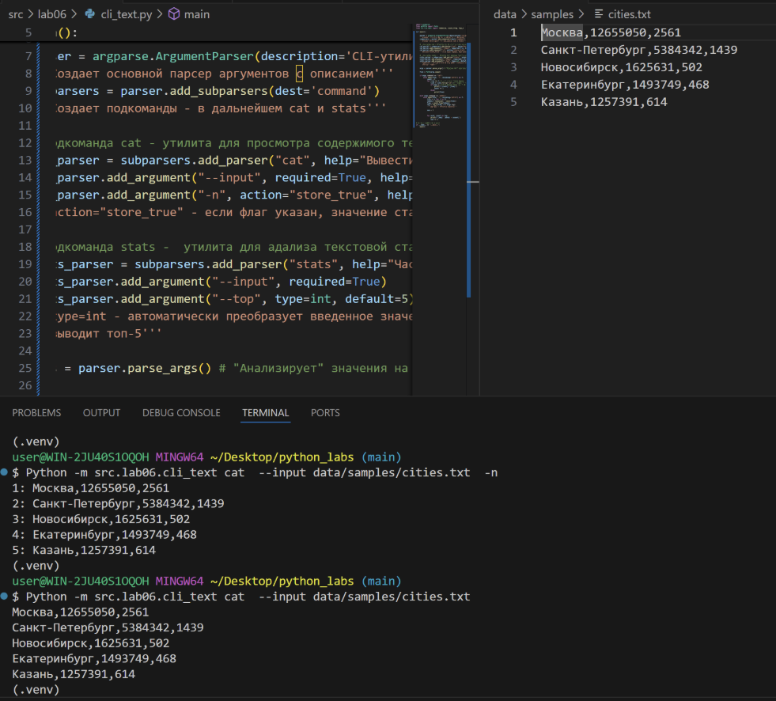
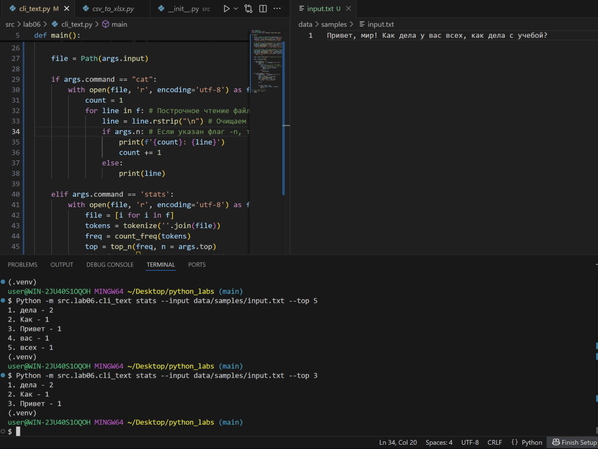
### CLI_convert
```python
import argparse
import sys
from src.lab05.json_to_csv import json_to_csv
from src.lab05.csv_to_json import csv_to_json
from src.lab05.csv_to_xlsx import csv_to_xlsx

def main():
    parser = argparse.ArgumentParser(description="Конвертеры данных")
    sub = parser.add_subparsers(dest="command")

    p1 = sub.add_parser("json2csv")
    p1.add_argument("--in", dest="input", required=True)
    p1.add_argument("--out", dest="output", required=True)

    p2 = sub.add_parser("csv2json")
    p2.add_argument("--in", dest="input", required=True)
    p2.add_argument("--out", dest="output", required=True)

    p3 = sub.add_parser("csv2xlsx")
    p3.add_argument("--in", dest="input", required=True)
    p3.add_argument("--out", dest="output", required=True)

    args = parser.parse_args() # "Анализирует" значения на входе

    if args.command == "json2csv":
        # Python -m src.lab06.cli_convert json2csv --in data/samples/people.json --out data/out/people_from_json.csv
        json_to_csv(json_path=args.input, csv_path=args.output)

    if args.command == "csv2json":
        # Python -m src.lab06.cli_convert csv2json --in data/samples/people.csv --out data/out/people_from_csv.json
        csv_to_json(csv_path=args.input, json_path=args.output)

    if args.command == "csv2xlsx":
        # Python -m src.lab06.cli_convert csv2xlsx --in data/samples/cities.csv --out data/out/cities.xlsx
        csv_to_xlsx(csv_path=args.input, xlsx_path=args.output)

if __name__ == "__main__":
    main()
```
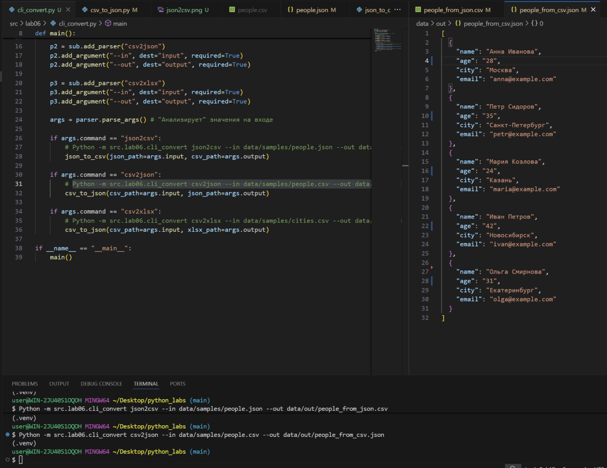
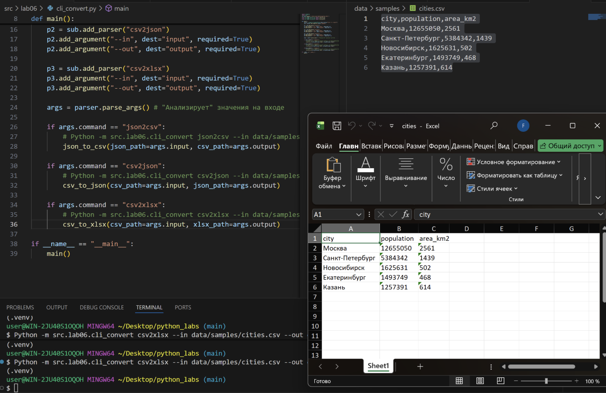
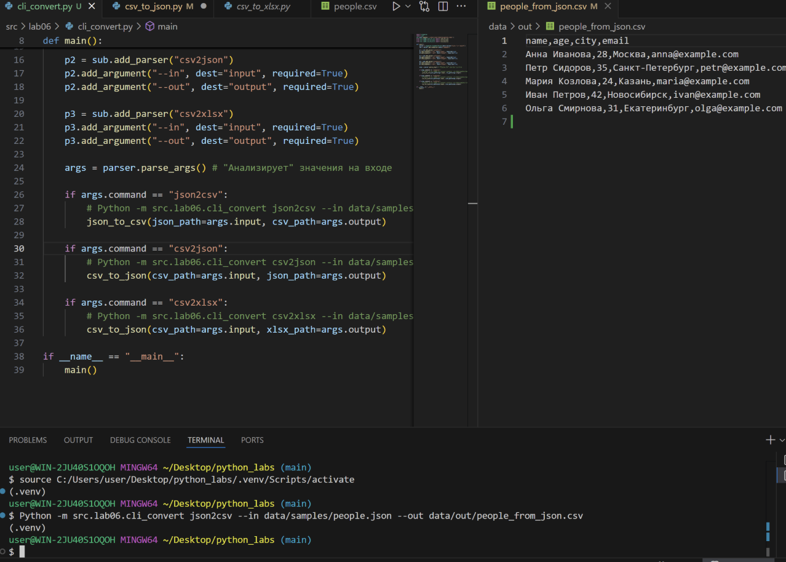

## Лабораторная работа 7
### Задание А
```python
import sys
sys.path.append("C:/Users/ravm7/OneDrive/Pa6ouni cton/python_labs/python_labs")
import pytest
import sys
from src.lib.text import normalize, tokenize, count_freq, top_n
import sys
import os

""" Проводим параметризацию, далее - для каждого теста. """
@pytest.mark.parametrize(
    "source, expected",
    [
        ("ПрИвЕт\nМИр\t", "привет мир"),
        ("ёжик, Ёлкa", "ежик, елкa"),
        ("Hello\r\nWorld", "hello world"),
        ("  двойные   пробелы  ", "двойные пробелы"),
        ("", "")
    ],
)
def test_normalize_basic(source, expected):
    assert normalize(source) == expected


@pytest.mark.parametrize(
    "source, expected",
    [
        ("привет, мир!", ["привет", "мир"]),
        ("по-настоящему круто", ["по-настоящему", "круто"]),   # работа с дефисом
        ("2025 год", ["2025", "год"]),   # чтение 
        ("emoji 😀 не слово", ["emoji", "не", "слово"]),    # удаление эмоджи
        ("    мноооооого ненужного!!", ["мноооооого", "ненужного"]),
        ("", [])   # пустой -> пустой
    ],
)
def test_tokenize_basic(source, expected):
    assert tokenize(source) == expected
    
@pytest.mark.parametrize(
    "tokens, expected",
    [
        (["a", "b", "a", "c", "b", "a"], {"a": 3, "b": 2, "c": 1}),
        ([], {}),   # пустой -> пустой
        (["test", "test", "test"], {"test": 3}),   #одинаковые слова
        (["🌍", "🚀", "🌍"], {"🌍": 2, "🚀": 1})   # обработка эмодзи
    ],
)

def test_count_freq_and_top_n(tokens, expected):
    assert count_freq(tokens) == expected

@pytest.mark.parametrize(
        "words, n, expected",
    [
        ({"b": 5, "a": 5, "c": 3, "d": 2}, 2, [("a", 5), ("b", 5)]),  # равные значения -> по алфавиту
        ({"x": 10}, 5, [("x", 10)]),   # n > dicts
        ({}, 3, []),   # пустой -> пустой
        ({"a": 1, "b": 1}, 0, []),   # n = 0
    ]
)
def test_top_n_tie_breaker(words, n, expected):
    assert top_n(words, n) == expected
```
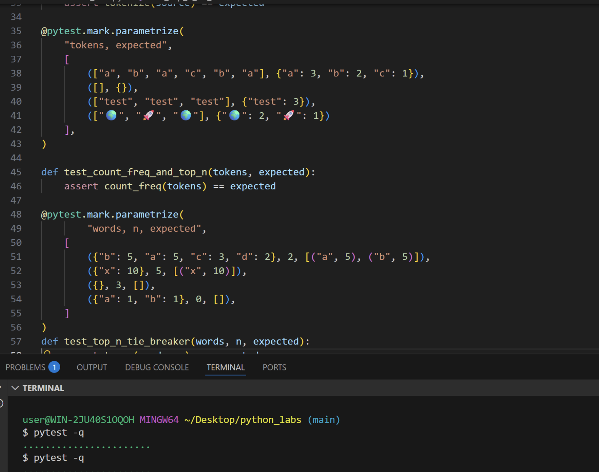

## Задание В
```python
import sys
sys.path.append("C:/Users/ravm7/OneDrive/Pa6ouni cton/python_labs/python_labs")
import pytest
from pathlib import Path
import sys
import json, csv
from src.lab05.csv_to_json import json_to_csv, csv_to_json


"""
С помощью фикстуры tmp_path создаём временные файлы для чтения и записы данных.
1 тест - проверка правильности записи базового случая
"""
def test_json_to_csv_roundtrip(tmp_path: Path):
    src = tmp_path / "people.json"
    dst = tmp_path / "people.csv"
    data = [
        {"name": "Alice", "age": 22},
        {"name": "Bob", "age": 25},
    ]
    src.write_text(json.dumps(data, ensure_ascii=False, indent=2), encoding="utf-8")
    json_to_csv(str(src), str(dst))

    with dst.open(encoding="utf-8") as f:
        rows = list(csv.DictReader(f))

    assert len(rows) == 2
    assert {"name", "age"} <= set(rows[0].keys())

"""Пустой файл"""
def test_json_to_csv_empty_file(tmp_path: Path):
    src = tmp_path / "people.json"
    dst = tmp_path / "people.csv"
    data = []
    src.write_text(json.dumps(data, ensure_ascii=False, indent=2), encoding="utf-8")


    with pytest.raises(ValueError, match="Пустой файл"):
        json_to_csv(str(src), str(dst))

"""Несуществующий путь"""
def test_json_to_csv_empty_file(tmp_path: Path):
    src = tmp_path / "nothing.json"
    dst = tmp_path / "people.csv"

    with pytest.raises(FileNotFoundError, match="Путь не найден"):
        json_to_csv(str(src), str(dst))

"""1 проверка формата"""
def test_json_to_csv_not_list(tmp_path: Path):
    src = tmp_path / "people.json"
    dst = tmp_path / "people.csv"
    data = {"name": "Alice", "age": 22}
    
    src.write_text(json.dumps(data, ensure_ascii=False, indent=2), encoding="utf-8")

    with pytest.raises(ValueError, match="Файл не JSON формата: не список словарей"):
        json_to_csv(str(src), str(dst))

"""2 проверка формата"""
def test_json_to_csv_not_dict(tmp_path: Path):
    src = tmp_path / "people.json"
    dst = tmp_path / "people.csv"
    data = ['name": "Alice", "age": 22', 'name": "Bob", "age": 25']
    
    src.write_text(json.dumps(data, ensure_ascii=False, indent=2), encoding="utf-8")

    with pytest.raises(ValueError, match="Файл не JSON формата: в списке не словари"):
        json_to_csv(str(src), str(dst))


"""Аналогично для обратного перевода"""
def test_csv_to_json_roundtrip(tmp_path: Path):
    src = tmp_path / "people.csv"
    dst = tmp_path / "people.json"

    csv_data = """name,age,city,email
Анна Иванова,28,Москва,anna@example.com
Петр Сидоров,35,Санкт-Петербург,petr@example.com"""

    src.write_text(csv_data, encoding="utf-8")

    csv_to_json(str(src), str(dst))

    with dst.open('r', encoding="utf-8") as f:
        data = json.load(f)
    
    # Проверка 
    assert isinstance(data, list)
    assert len(data) == 2
    assert isinstance(data[0], dict)
    assert isinstance(data[1], dict)

# Бро вот еще тесты и тд

"""Пустой файл"""
def test_csv_to_json_empty_file(tmp_path: Path):
    src = tmp_path / "people.csv"
    dst = tmp_path / "people.json"

    csv_data = ""

    src.write_text(csv_data, encoding="utf-8")

    with pytest.raises(ValueError, match="Пустой файл"):
        csv_to_json(str(src), str(dst))
    
"""Несуществующий файл"""
def test_csv_to_json_empty_file(tmp_path: Path):
    src = tmp_path / "nothing.csv"
    dst = tmp_path / "people.json"

    with pytest.raises(FileNotFoundError, match="Файл не найден"):
        csv_to_json(str(src), str(dst))

"""Не тот формат файла"""
def test_csv_to_json_type(tmp_path: Path):
    src = tmp_path / "input.txt"
    dst = tmp_path / "people.json"

    txt_data = """name,age,city,email
Анна Иванова,28,Москва,anna@example.com
Петр Сидоров,35,Санкт-Петербург,petr@example.com"""

    src.write_text(txt_data, encoding="utf-8")

    with pytest.raises(ValueError, match="Неверный тип файла"):
        csv_to_json(str(src), str(dst))
```
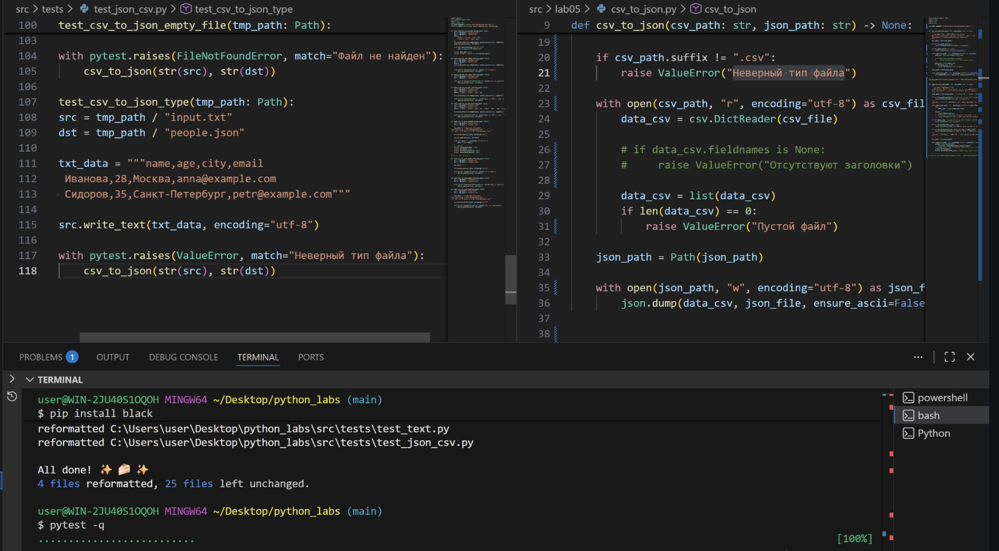

## Задание С
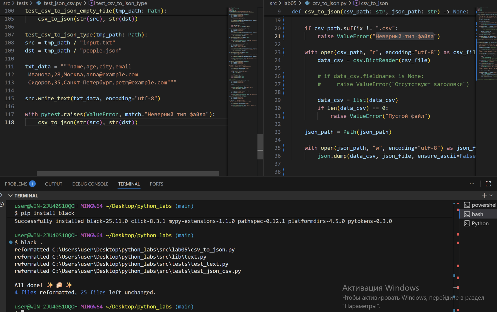

### Лабораторная работа 8
## Задание А
```python
from dataclasses import dataclass
from datetime import datetime, date


@dataclass
class Student:
    fio: str
    birthdate: str
    group: str
    gpa: float

    def __post_init__(self):
        # Валидация формата даты
        try:
            datetime.strptime(self.birthdate, "%Y-%m-%d")
        except ValueError:
            raise ValueError("Неверная запись времени")

        # Валидация диапазона GPA
        if not (0 <= self.gpa <= 5):
            raise ValueError("GPA должен находиться между 0 и 5")

    def age(self) -> int:
        """Возвращает количество полных лет"""
        birth_day = datetime.strptime(self.birthdate, "%Y-%m-%d").date()
        today = date.today()
        if birth_day > today:
            raise ValueError("Студент еще не родился")
        if today.month < birth_day.month or (
            today.month == birth_day.month and today.day < birth_day.day
        ):
            return today.year - birth_day.year - 1
        return today.year - birth_day.year

    def to_dict(self) -> dict:
        return {
            "Студент": self.fio,
            "Группа": self.group,
            "Дата рождения": self.birthdate,
            "Средний балл": self.gpa,
        }

    @classmethod # Метод создаёт новый объект из существующих данных
    def from_dict(cls, d: dict):
        # Создание объекта класса Student из словаря
        return cls(
            fio=d['Студент'], group=d["Группа"], birthdate=d["Дата рождения"], gpa=d["Средний балл"]
        )

    def __str__(self):
        return (f"Студент: {self.fio};\n"
                f"Группа: {self.group};\n"
                f"Дата рождения: {self.birthdate};\n"
                f"Средний балл: {self.gpa}.")
    
###Пример запуска
    
if __name__ == "__main__":
    student = Student("Иванов Иван Иванович", "2007-01-15", "БИВТ-25-1", 4.5)
    print(student)
    print( "=" * 140)

    # age
    print(f"Возраст: {student.age()}")
    
    # to_dict
    student_dict = student.to_dict()
    print(f"Сериализованный: {student_dict}")
    
    # from_dict
    restored_student = Student.from_dict(student_dict)
    print(f"Десериализованный: {restored_student}")
```

## Задание B
```python
from dataclasses import dataclass
from datetime import datetime, date


@dataclass
class Student:
    fio: str
    birthdate: str
    group: str
    gpa: float

    def __post_init__(self):
        # Валидация формата даты
        try:
            datetime.strptime(self.birthdate, "%Y-%m-%d")
        except ValueError:
            raise ValueError("Неверная запись времени")

        # Валидация диапазона GPA
        if not (0 <= self.gpa <= 5):
            raise ValueError("GPA должен находиться между 0 и 5")

    def age(self) -> int:
        """Возвращает количество полных лет"""
        birth_day = datetime.strptime(self.birthdate, "%Y-%m-%d").date()
        today = date.today()
        if birth_day > today:
            raise ValueError("Студент еще не родился")
        if today.month < birth_day.month or (
            today.month == birth_day.month and today.day < birth_day.day
        ):
            return today.year - birth_day.year - 1
        return today.year - birth_day.year

    def to_dict(self) -> dict:
        return {
            "Студент": self.fio,
            "Группа": self.group,
            "Дата рождения": self.birthdate,
            "Средний балл": self.gpa,
        }

    @classmethod # Метод создаёт новый объект из существующих данных
    def from_dict(cls, d: dict):
        # Создание объекта класса Student из словаря
        return cls(
            fio=d['Студент'], group=d["Группа"], birthdate=d["Дата рождения"], gpa=d["Средний балл"]
        )

    def __str__(self):
        return (f"Студент: {self.fio};\n"
                f"Группа: {self.group};\n"
                f"Дата рождения: {self.birthdate};\n"
                f"Средний балл: {self.gpa}.")
    
###Пример запуска
    
if __name__ == "__main__":
    student = Student("Иванов Иван Иванович", "2007-01-15", "БИВТ-25-1", 4.5)
    print(student)
    print( "=" * 140)

    # age
    print(f"Возраст: {student.age()}")
    
    # to_dict
    student_dict = student.to_dict()
    print(f"Сериализованный: {student_dict}")
    
    # from_dict
    restored_student = Student.from_dict(student_dict)
    print(f"Десериализованный: {restored_student}")
```
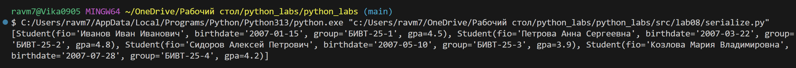

### Лабораторная работа 9
## Задание А
```python
import csv
from pathlib import Path
import sys

sys.path.append("C:/Users/user/Desktop/python_labs/")
from src.lab08.models import Student


class Group:
    def __init__(self, storage_path: str):
        self.path = Path(storage_path)
        self._ensure_storage_exists()
        # self._validation()

    def _ensure_storage_exists(self) -> None:
        """Создаём файл для записи, если его нет"""
        if not self.path.exists():
            with open(self.path, "w", encoding="utf-8", newline="") as f:
                writer = csv.DictWriter(
                    f, fieldnames=["Студент", "Группа", "Дата рождения", "Средний балл"]
                )
                writer.writeheader()

    # def _validation(self):
    #     with

    def _read_all(self):
        """Читает все строки из csv-файла"""
        rows = []
        with self.path.open("r", encoding="utf-8") as csv_file:
            data_csv = csv.DictReader(csv_file)
            if data_csv.fieldnames != [
                "Студент",
                "Группа",
                "Дата рождения",
                "Средний балл",
            ]:
                raise ValueError("Неккоректные заголовки")
            for row in data_csv:
                try:
                    float(row["Средний балл"])
                except ValueError:
                    raise ValueError("Средний балл должен быть числом")
                rows.append(row)
        return rows

    def _write_all(self, rows):
        """Записать все строки в CSV файл"""
        with open(self.path, "w", newline="", encoding="utf-8") as file:
            writer = csv.DictWriter(
                file, fieldnames=["Студент", "Группа", "Дата рождения", "Средний балл"]
            )
            writer.writeheader()
            writer.writerows(rows)

    def list(self) -> list[Student]:
        rows = self._read_all()
        students = []
        for row in rows:
            try:
                student = Student.from_dict(row)
                students.append(student)
            except ValueError:
                raise ValueError("Ошибка валидации студента")

        return students

    def add(self, student: Student):
        """Добавить в список ещё 1 строку-студента"""
        all_students = self._read_all()

        if not isinstance(student, Student):  # Проверка корректности формата данных
            raise ValueError("Должен быть передан объект Student")
        for row in all_students:  # Проверяем, есть ли уже такой студент в списке
            if row["Студент"] == student.fio:
                raise ValueError(f"Студент с ФИО '{student.fio}' уже существует")

        try:
            validated_student = Student(
                fio=student.fio,
                birthdate=student.birthdate,
                group=student.group,
                gpa=student.gpa,
            )
        except ValueError:
            raise ValueError("Ошибка валидации студента")

        with open(self.path, "a", encoding="utf-8", newline="") as f:
            writer = csv.DictWriter(
                f, fieldnames=["Студент", "Группа", "Дата рождения", "Средний балл"]
            )
            writer.writerow(validated_student.to_dict())

    def find(self, substr: str):
        students = self.list()
        return [
            student for student in students if substr.lower() in student.fio.lower()
        ]

    def remove(self, fio: str):
        """Удалить записи с определенным ФИО"""
        rows = self._read_all()
        initial_count = len(rows)

        rows = [row for row in rows if row["Студент"] != fio]
        if len(rows) == initial_count:
            raise ValueError(f"Студент с ФИО '{fio}' не найден")
        self._write_all(rows)

    def update(self, fio: str, **fields):
        """
        Обновить поля существующего студента
        **fields - передаёт любое количество полей для обновления
        """
        all_students = self._read_all()
        updated = (
            False  # Используем флаг, чтобы в случае отсутсвия студента вывести ошибку
        )

        for student in all_students:
            if student["Студент"] == fio:
                if "Группа" in fields:
                    student["Группа"] = fields["Группа"]
                if "Дата рождения" in fields:
                    student["Дата рождения"] = fields["Дата рождения"]
                if "Балл" in fields:
                    student["Средний балл"] = fields["Балл"]
                updated = True  # Поднимаем флаг
                break

                if not updated:
                    raise ValueError(f"Студент с ФИО {fio} не найден")

        self._write_all(all_students)


if __name__ == "__main__":

    group = Group("data/lab09/students.csv")  # Создаем группу

    print("Просмотр всей группы студентов:")
    students = group.list()
    for student in students:
        print(student)
        print()

    # Добавление новых студентов
    new_students = [
        Student("Смирнов Дмитрий Александрович", "2007-07-18", "БИВТ-25-1", 4.2),
        Student("Кузнецова Екатерина Игоревна", "2007-09-05", "БИВТ-25-2", 4.6),
    ]
    for student in new_students:
        group.add(student)

    print("Поиск студента по фамилии Петрова")
    for student in group.find("Петрова"):
        print(f"  {student}")

    print("Удаление студента с ФИО Сидоров Алексей Петрович:")
    group.remove("Сидоров Алексей Петрович")
    students = group.list()
    for student in students:
        print(f"  {student}")

    print("Изменение существующей информации:")
    print("Данные Ивана до:")
    for student in group.find("Иванов"):
        print(f"  {student}")
    group.update("Иванов Иван Иванович", Группа="БИВТ-25-8", Балл=4.8)
    print("Данные Ивана после:")
    for student in group.find("Иванов"):
        print(f"  {student}")
```
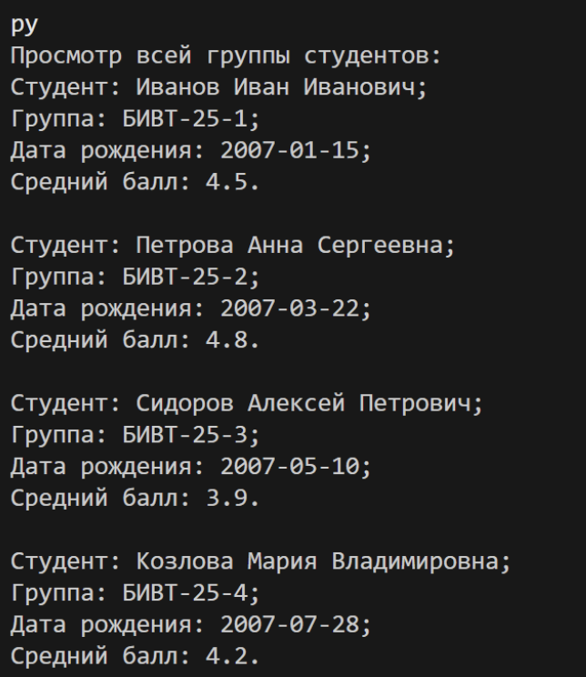
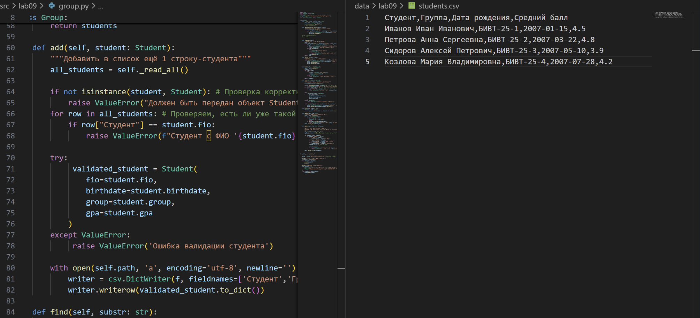
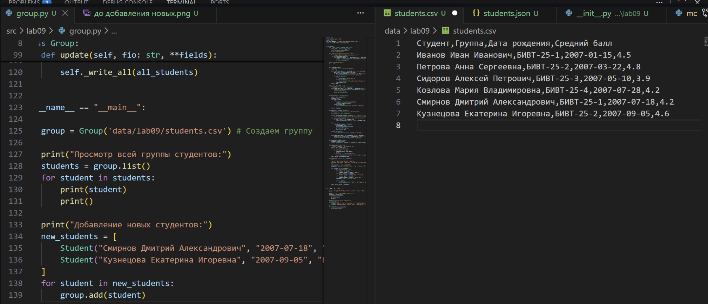
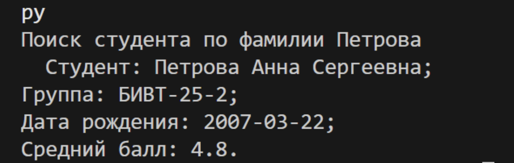
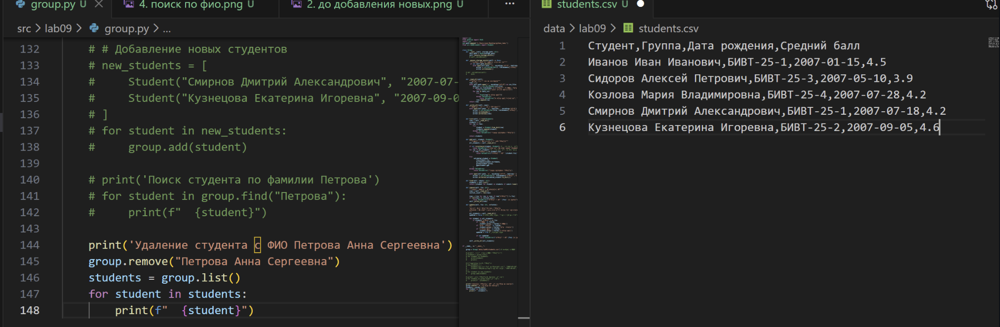
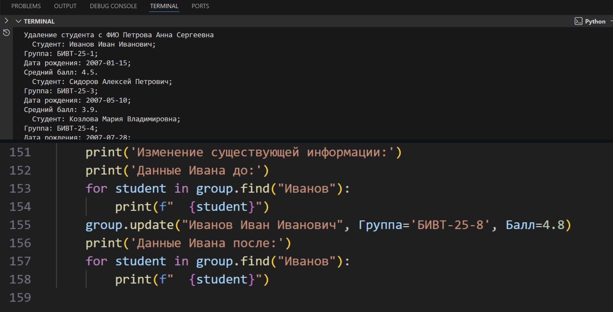
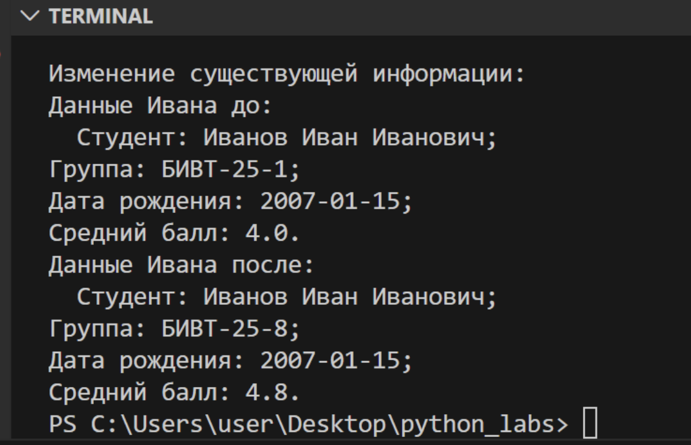
