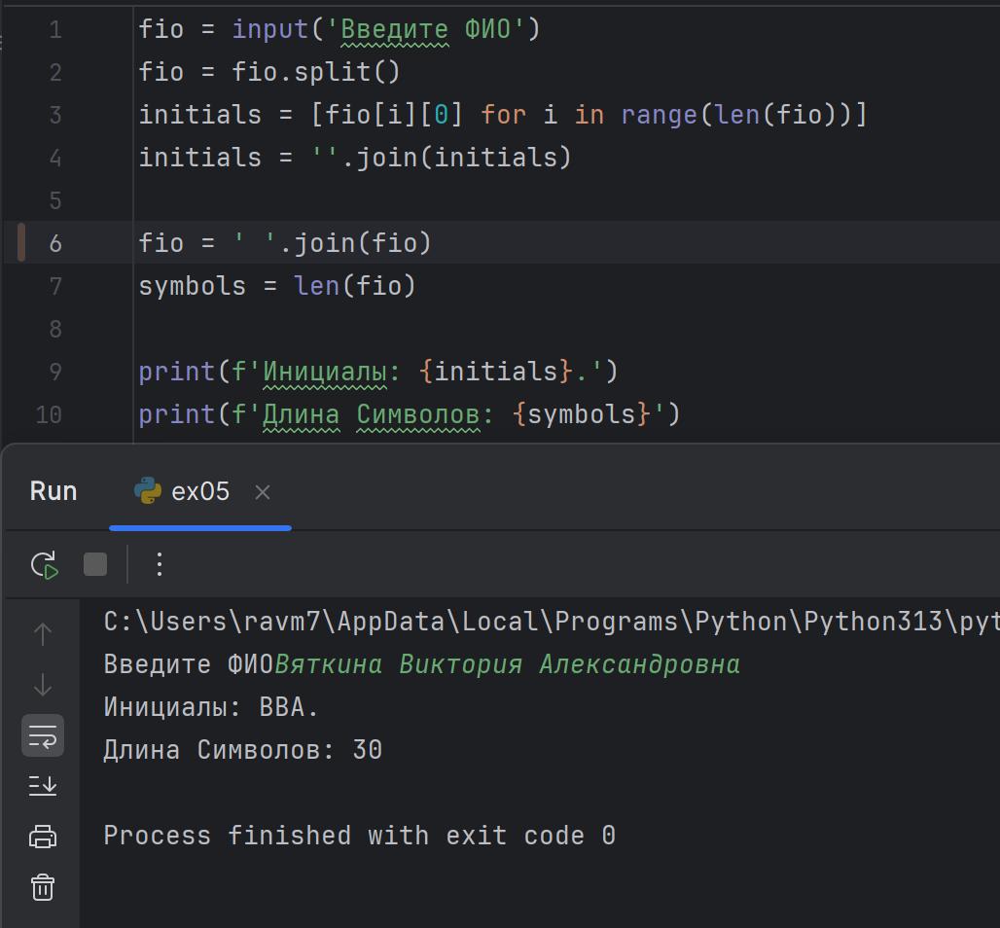

# python_labs

## Лабораторная работа 1

### Задание номер 1

```python
name = input('ИМЯ:')
age = int(input('ВОЗРАСТ:'))
print(f'Привет, {name}! Через год тебе будет {age + 1}.')
```


### Задание номер 2

```python
a = float(input('Введите число').replace(',', '.'))
b = float(input('Введите число').replace(',', '.'))
s = a + b
av =round(s / 2, ndigits = 2)
print(f'sum = {s}; avg = {av}')
```


### Задание номер 3
```python
price = float(input('Цена, ₽:'))
discount = float(input('Скидка, %:'))
vat = float(input('НДС, %:'))

base = price * ( 1 - discount / 100)
vat_amount = base * (vat / 100)
total = base + vat_amount
print(f'База после скидки: {base:.2f} ₽')
print(f'НДС: {vat_amount:.2f} ₽')
print(f'Итого к оплате: {total:.2f} ₽')
```


### Задание номер 4
```python
m = int(input('Целые минуты'))
hours = m//60
minutes = m % 60
print(f'{hours}:{minutes:02d}')
```


### Задание номер 5
```python
fio = input('Введите ФИО')
fio = fio.split()
initials = [fio[i][0] for i in range(len(fio))]
initials = ''.join(initials)

fio = ''.join(fio)
symbols = len(fio)

print(f'Инициалы: {initials}.')
print(f'Длина Символов: {symbols}')
```

